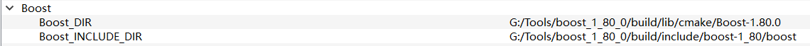

> 时间：2023.1.3
> 作者：陌尘
> 源码：[VTK 9.2.2](https://github.com/Kitware/VTK/releases/tag/v9.2.2)
> 工具：[Visual Studio 2017](https://link.zhihu.com/?target=https%3A//visualstudio.microsoft.com/zh-hans/vs/older-downloads/)、[CMake 3.24.1 x64](https://link.zhihu.com/?target=https%3A//cmake.org/download/)
> 依赖：[Qt 5.12.11](https://link.zhihu.com/?target=https%3A//download.qt.io/archive/qt/5.12/5.12.11/)、[Python 3.10.8](https://link.zhihu.com/?target=https%3A//www.python.org/downloads/windows/)
> 平台：Windows 10 21H2
> Refer：[Build VTK](https://github.com/Kitware/VTK/blob/master/Documentation/dev/build.md)


### 0.Preface

本文编译 VTK 所有模块，较为繁琐，仅供参考，无需编译所有模块可参考 [build_windows_vs](https://github.com/Kitware/VTK/blob/master/Documentation/dev/build_windows_vs.md)


### 1.编译准备

1. VTK 9.2.2 源码下载：[VTK 9.2.2](https://github.com/Kitware/VTK/releases/tag/v9.2.2)
2. Python 3.10.8 下载：[Python 3.10.8](https://link.zhihu.com/?target=https%3A//www.python.org/downloads/windows/)


### 2.CMake 配置

1. 在 CMake-gui 中选择源码路径，选择编译工程路径

   

2. 点击【Configure】，选择项目生成工具为 “Visual Sdudio 15 2017”，选择平台为 “x64”，等待配置完成 “Configuring done”

3. CMAKE_INSTALL_PREFIX

   这个是编译完成之后库的输出路径，默认为存在 C 盘，如果没有以管理员身份启动 CMake-gui，可能会生成失败。 本文设置为 “G:/VTK/VTK-9.2.2/release”

4. VTK_BUILD_ALL_MODULES

   编译 VTK 所有模块，勾选

5. FFmpeg 报错

   ```
   CMake Error at CMake/vtkModule.cmake:4578 (message):
     Could not find the FFMPEG external dependency.
   Call Stack (most recent call first):
     IO/FFMPEG/CMakeLists.txt:1 (vtk_module_find_package)
   ```

   FFmpeg 下载：[FFmpeg-n5.1.2-9-win64-lgpl-shared](https://github.com/BtbN/FFmpeg-Builds/releases/download/autobuild-2023-01-02-12-37/ffmpeg-n5.1.2-9-g807afa59cc-win64-lgpl-shared-5.1.zip)

   CMake 配置 FFmpeg

   

6. Boost 报错

   ```
   CMake Error at CMake/vtkModule.cmake:4578 (message):
     Could not find the Boost external dependency.
   Call Stack (most recent call first):
     Infovis/BoostGraphAlgorithms/CMakeLists.txt:23 (vtk_module_find_package)
   ```

   下载 boost 以及相关库：

   - 下载 Boost：[boost_1_80_0-msvc-14.1-64.exe](https://boostorg.jfrog.io/artifactory/main/release/1.80.0/binaries/)

     下载完成后安装 boost，在 boost 安装路径中新建 build、temp 文件夹

   - 下载 zlib：[zlib-1.2.13](https://github.com/madler/zlib/releases/tag/v1.2.13)

   - 下载 bzip2：[bzip2-1.0.8](https://github.com/libarchive/bzip2/releases/tag/bzip2-1.0.8)

   编译 boost：

   - 将 zlib、bzip2 源码文件夹放到 boost 安装路径下

   - 开始菜单中 Visual Sdudio 2017 文件夹下找到 “适用于 VS 2017 的 x86_x64 兼容工具命令提示”，以管理员身份运行

   - 切换到 boost 安装目录

     ```
     cd /d G:\Tools\boost_1_80_0
     ```

   - 按 Tab 键切换到 bootstrap.bat，回车，等待命令执行完成

   - 键入 boost 编译命令，等待编译完成

     ```
     b2 install --toolset=msvc-14.1 --prefix="G:\Tools\boost_1_80_0\build" --build-dir="G:\Tools\boost_1_80_0\temp" architecture=x86 address-model=64 link=static runtime-link=shared threading=multi variant=release
     ```

     boost 默认无 zlib 和 bzip2，再次执行命令编译 zlib 和 bzip2

     ```
     b2 install --toolset=msvc-14.1 --with-iostreams -s BZIP2_SOURCE="G:\Tools\bzip2-1.0.8" -s ZLIB_SOURCE="G:\Tools\zlib-1.2.13" --toolset=msvc-14.1 --prefix="G:\Tools\boost_1_80_0\build" --build-dir="G:\Tools\boost_1_80_0\temp" architecture=x86 address-model=64 link=static runtime-link=shared threading=multi variant=release
     ```

     ps：

     关于命令的详细信息，可以输入 `b2 --help` 查看

     --toolset=msvc-14.1：编译工具集，VS 2017 是 msvc-14.1

     --prefix="G:\Tools\boost_1_80_0\build"：boost 编译输出路径，换成自己的

     --build-dir="G:\Tools\boost_1_80_0\temp"：编译临时文件路径，换成自己的

     BZIP2_SOURCE="G:\Tools\bzip2-1.0.8"：bzip2 源码路径，换成自己的

     ZLIB_SOURCE="G:\Tools\zlib-1.2.13"：zlib 源码路径，换成自己的

     architecture=x86 address-model=64：x86 架构，编译 64 位库

     link=static：编译 boost 静态库

     runtime-link=shared：动态链接 C++ 运行时库

     threading=multi：使用多线程编译

     variant=release：编译 release 版本库

   - CMake 配置 boost 路径

     

7. ospray 报错

   ```
   osprayCMake Error at CMake/vtkModule.cmake:4578 (message):
     Could not find the ospray external dependency.
   Call Stack (most recent call first):
     Rendering/RayTracing/CMakeLists.txt:58 (vtk_module_find_package)
   ```

   下载 ospray ：[ospray 2.1.1](https://github.com/ospray/OSPRay/releases?page=2)

   CMake 配置 ospray

   

8. OpenXR 报错

   ```
   CMake Error at CMake/vtkModule.cmake:4578 (message):
     Could not find the OpenXR external dependency.
   Call Stack (most recent call first):
     Rendering/OpenXR/CMakeLists.txt:1 (vtk_module_find_package)
   ```

   下载 OpenXR：OpenXRhttps://github.com/KhronosGroup/OpenXR-SDK/releases/tag/release-1.0.26

   CMake 配置 OpenXR

   

9. OpenXR 报错

   ```
   CMake Error at CMake/vtkModule.cmake:4578 (message):
     Could not find the OpenVR external dependency.
   Call Stack (most recent call first):
     Rendering/OpenVR/CMakeLists.txt:1 (vtk_module_find_package)
   ```

   下载 OpenVR：[OpenVR](https://github.com/ValveSoftware/openvr/releases)

   CMake 配置 OpenVR

   

10. FontConfig 报错

    ```
    CMake Error at CMake/vtkModule.cmake:4578 (message):
      Could not find the FontConfig external dependency.
    Call Stack (most recent call first):
      Rendering/FreeTypeFontConfig/CMakeLists.txt:18 (vtk_module_find_package)
    ```

    下载 FontConfig ：[libfontconfig_2.14.1_msvc15](https://github.com/ShiftMediaProject/fontconfig/releases/tag/2.14.1)

    CMake 配置 FontConfig

    

11. PostgreSQL 报错

    ```
    CMake Error at CMake/vtkModule.cmake:4578 (message):
      Could not find the PostgreSQL external dependency.
    Call Stack (most recent call first):
      IO/PostgreSQL/CMakeLists.txt:1 (vtk_module_find_package)
    ```

    PostgreSQL：[PostgreSQL 15](https://www.enterprisedb.com/download-postgresql-binaries)

    CMake 配置 PostgreSQL

    

12. PDAL 报错

    ```
    CMake Error at CMake/vtkModule.cmake:4578 (message):
      Could not find the PDAL external dependency.
    Call Stack (most recent call first):
      IO/PDAL/CMakeLists.txt:1 (vtk_module_find_package)
    ```

    

13. OpenImageDenoise 报错

    ```
    CMake Error at CMake/vtkModule.cmake:4578 (message):
      Could not find the OpenImageDenoise external dependency.
    Call Stack (most recent call first):
      Rendering/RayTracing/CMakeLists.txt:67 (vtk_module_find_package)
    ```

    下载 OpenImageDenoise：[Open Image Denoise v1.4.3](https://github.com/OpenImageDenoise/oidn/releases/tag/v1.4.3)

14. 


